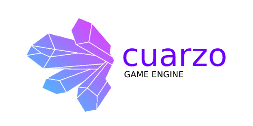

<div align="center">


[](LICENSE)
[](https://discord.gg/fnc9WWnY)

</div>

> 🚀 🙉 Introducing Cuarzo Engine, a JavaScript 2D engine with Game Streaming support that allows you to create incredible games quickly and easily. 🕹️💻

### Key Features

- 🚀 **Optimized Performance:** Enjoy smooth and uninterrupted gameplay thanks to our cutting-edge performance optimization, specially tailored for Game Streaming environments.

- 🌐 **Cross-Platform:** Create games for web browsers and mobile devices, ensuring a wide reach for your audience, including users from Game Streaming platforms.

- 🛠️ **Intuitive Tools:** Our friendly toolkit makes game development and creation efficient, providing a smooth experience for both developers and streamers.

- 🎨 **Stunning Graphics:** Bring your games to life with high-quality graphics, visual effects, and smooth animations, ensuring a visually appealing experience even during streaming.

- 🧩 **Flexibility and Customization:** Adapt the engine to your specific needs with its modular architecture and customization capabilities, allowing you to create unique and exciting games for streaming.

- ⚡️ **Reactive Programming:** Cuarzo Engine offers support for reactive programming, allowing you to create interactive and dynamic games by automatically managing and reacting to events and changes in game data. Harness the power of reactive programming to create exciting gameplay mechanics and smooth player experiences.

### Documentation

Check out our comprehensive [documentation](https://github.com/gabriedev/cuarzo-docs) for detailed instructions, examples, and guides specifically designed for Game Streaming compatibility. Take advantage of the available resources to create engaging and streaming-ready games.

### Installation

To start using Cuarzo Engine, follow these steps for installation:

Install Cuarzo Engine via npm by running the following command:

```bash
npm install cuarzo
```

Once the installation is complete, you can import Cuarzo into your JavaScript project:

```js
import { Cuarzo } from 'cuarzo/core'
import { Node2D } from 'cuarzo/node'
import { Sprite } from 'cuarzo/sprite'

// Your game code here
```

You are now ready to use Cuarzo Engine in your project.

#### Getting Started

To begin creating games with Cuarzo Engine, visit our [Getting Started](https://github.com/gabriedev/cuarzo-docs) page in the Cuarzo Engine documentation repository. On this page, you will find detailed information on how to set up your development environment and create your first game using the engine.

Follow the provided steps on the "Getting Started" page to start developing your own games with Cuarzo Engine.

Congratulations again on the npm publication of Cuarzo Engine! This updated installation section will help users get started quickly with the npm package.

### Example

Discover the power of Cuarzo Engine with our simple example to start creating games quickly and easily! We have several example projects in the [Cuarzo Engine repository](https://github.com/gabriedev/cuarzo). Here's the first simple example to get started:

```js
import { Cuarzo } from 'cuarzo/core'
import { Node2D } from 'cuarzo/node/node2D'
import { Sprite } from 'cuarzo/sprite'

const character = new Node2D('character') // Create the Node2D for the game character
Sprite(character, 'sprite_name', 'path_to_character_image.png') // Create the character Sprite

Cuarzo.init()
Cuarzo.onLoaded(() => {
  // Mount the objects in the game area
  Cuarzo.mount([character])
})
```

In this example, Cuarzo Engine provides you with a minimalist structure to bring your games to life. With just a few lines of code, you can create a Node2D that holds a character. By using the Node2D module, you can define a container with the properties your character needs to represent in the game. Then, with the Sprite module, you can assign an image to the character to give it a visual appearance.

The Cuarzo Engine is initialized by calling Cuarzo.init(), and once all the internal resources are loaded using Cuarzo.onLoaded(), you can mount the character to the game area using Cuarzo.mount([character]).

This example is just the beginning of what you can achieve with Cuarzo Engine. Use it as a starting point to create your own 2D games easily and efficiently. We encourage you to explore more in our Cuarzo Engine repository and join our community, where you can receive support, share your creations, and collaborate with other developers.

### Contribution

We are open to collaborations and improvements! If you would like to contribute to Cuarzo Engine, please review our [contribution guidelines](CONTRIBUTING.md) for more information on how you can collaborate with us.

### License

This documentation and each page it contains are published under the terms of the [Creative Commons Attribution 3.0 License (CC BY 3.0)](https://creativecommons.org/licenses/by/3.0/), with attribution to "César Leañez, the Cuarzo development team, and its community."

By contributing to the documentation in the GitHub repository, you agree that your changes will be distributed under this license.

### Community

Join our community on [Discord](https://discord.gg/fnc9WWnY) to connect with other developers and streamers, share ideas, get help, and keep us updated on your projects and streaming experiences.

We look forward to seeing you soon, creating exciting games and streaming them live with Cuarzo Engine!
